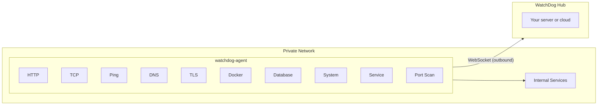

```
██╗    ██╗ █████╗ ████████╗ ██████╗██╗  ██╗██████╗  ██████╗  ██████╗
██║    ██║██╔══██╗╚══██╔══╝██╔════╝██║  ██║██╔══██╗██╔═══██╗██╔════╝
██║ █╗ ██║███████║   ██║   ██║     ███████║██║  ██║██║   ██║██║  ███╗
██║███╗██║██╔══██║   ██║   ██║     ██╔══██║██║  ██║██║   ██║██║   ██║
╚███╔███╔╝██║  ██║   ██║   ╚██████╗██║  ██║██████╔╝╚██████╔╝╚██████╔╝
 ╚══╝╚══╝ ╚═╝  ╚═╝   ╚═╝    ╚═════╝╚═╝  ╚═╝╚═════╝  ╚═════╝  ╚═════╝
                              Agent
```
**Lightweight Monitoring Agent for Private Networks**

> Part of [WatchDog](https://github.com/sylvester-francis/watchdog) — live at [usewatchdog.dev](https://usewatchdog.dev)


[Installation](#installation) · [Configuration](#configuration) · [Check Types](#check-types) · [Running as a Service](#running-as-a-service)

---

## What is WatchDog Agent?

WatchDog Agent is a lightweight Go binary that runs inside your network and performs health checks against internal and external targets. It connects **outbound** to the [WatchDog Hub](https://github.com/sylvester-francis/watchdog) over WebSocket — no inbound firewall rules required.

This is part of the [WatchDog](https://github.com/sylvester-francis/watchdog) monitoring system, the only open-source monitoring tool with native agent-based distributed architecture.

**Key Features:**

- **Zero-Config** — Only needs an API key, all monitoring tasks are pushed from the Hub
- **10 Check Types** — HTTP, TCP, Ping, DNS, TLS certificates, Docker containers, Databases (PostgreSQL, MySQL, Redis), System metrics (CPU, memory, disk), Service monitoring (systemd/Windows), and Port Scanning
- **Auto-Reconnection** — Automatically reconnects and resumes monitoring on connection loss
- **Cross-Platform** — Pre-built binaries for Linux, macOS, and Windows (amd64/arm64)
- **Minimal Footprint** — Scratch-based Docker image, single binary deployment

## How It Works



1. Agent connects to the Hub via WebSocket and authenticates with an API key
2. Hub pushes monitoring tasks (targets, intervals, timeouts)
3. Agent runs checks on the configured interval
4. Results (status, latency, errors) are sent back as heartbeats
5. On disconnect, the agent automatically reconnects after 5 seconds

## Installation

### One-Liner Install (Linux)

Downloads the latest release, installs to `/usr/local/bin`, and configures a systemd service:

```bash
curl -sSL https://raw.githubusercontent.com/sylvester-francis/watchdog-agent/main/scripts/install-agent.sh | sudo sh -s -- \
  --api-key YOUR_API_KEY \
  --hub-url wss://usewatchdog.dev/ws/agent
```

| Option | Description | Default |
|--------|-------------|---------|
| `--api-key` | Agent API key (required) | — |
| `--hub-url` | Hub WebSocket URL | `ws://localhost:8080/ws/agent` |
| `--repo` | GitHub repository for release download | `sylvester-francis/watchdog-agent` |

### Download Binary

Pre-built binaries are available on the [Releases](https://github.com/sylvester-francis/watchdog-agent/releases) page:

| Platform | Binary |
|----------|--------|
| Linux (x86_64) | `agent-linux-amd64` |
| Linux (ARM64) | `agent-linux-arm64` |
| macOS (x86_64) | `agent-darwin-amd64` |
| macOS (ARM64) | `agent-darwin-arm64` |
| Windows (x86_64) | `agent-windows-amd64.exe` |

```bash
curl -fsSL -o watchdog-agent \
  https://github.com/sylvester-francis/watchdog-agent/releases/latest/download/agent-linux-amd64
chmod +x watchdog-agent
./watchdog-agent --api-key YOUR_API_KEY --hub wss://usewatchdog.dev/ws/agent
```

### Docker

```bash
docker run -d \
  --name watchdog-agent \
  --restart always \
  ghcr.io/sylvester-francis/watchdog-agent:latest \
  -hub wss://usewatchdog.dev/ws/agent \
  -api-key YOUR_API_KEY
```

### Build from Source

```bash
git clone https://github.com/sylvester-francis/watchdog-agent.git
cd watchdog-agent
go build -o watchdog-agent .
```

Cross-platform release build:

```bash
VERSION=1.0.0 ./scripts/build-agent.sh
# Output: bin/agent-{os}-{arch}
```

## Configuration

### Command-Line Flags

| Flag | Description | Default |
|------|-------------|---------|
| `-hub` | Hub WebSocket URL | `ws://localhost:8080/ws/agent` |
| `-api-key` | Agent API key | — |
| `-debug` | Enable debug logging | `false` |
| `-version` | Print version and exit | — |

### Environment Variables

| Variable | Description |
|----------|-------------|
| `WATCHDOG_API_KEY` | Agent API key (alternative to `-api-key` flag) |

The `-api-key` flag takes precedence over the environment variable.

## Check Types

### HTTP

Performs an HTTP GET request. Follows up to 10 redirects. Reports `up` for 2xx/3xx, `down` for 4xx/5xx, `timeout` if the request exceeds the configured timeout.

```
Target: https://example.com/health
```

### TCP

Opens a TCP connection to the target host and port. Reports `up` if the connection succeeds, `down` if refused, `timeout` if it exceeds the configured timeout.

```
Target: database.internal:5432
```

### Ping

TCP-based reachability check (ICMP requires elevated privileges). Tries port 80 and 443 sequentially. Reports `up` if either port responds.

```
Target: internal-host.example.com
```

### DNS

Performs a DNS lookup on the target hostname. Reports `up` if the lookup succeeds and returns records, `down` if the lookup fails or returns no results.

```
Target: example.com
```

### Docker

Checks if a Docker container is running and healthy via the Docker socket (`/var/run/docker.sock`). Reports `up` if the container is running (and healthy, if a health check is configured), `down` otherwise.

```
Target: my-container-name
```

### Database

Connects to a database and runs a ping/health check. Supports PostgreSQL, MySQL, and Redis. The database type is specified via task metadata (`db_type`). Optionally accepts a `connection_string` in metadata, otherwise builds one from the target.

```
Target: db-host:5432
Metadata: {"db_type": "postgres"}
```

Supported `db_type` values: `postgres`, `mysql`, `redis`

### System

Monitors local system metrics against a threshold. Reports `down` if usage exceeds the threshold. Supported metrics: `cpu`, `memory`, `disk`. System metrics are only available on Linux.

```
Target: cpu:90          (alert if CPU > 90%)
Target: memory:80       (alert if memory > 80%)
Target: disk:90:/       (alert if disk usage on / > 90%)
```

### Service

Checks if an OS service is running. Uses `systemctl is-active` on Linux and `sc query` on Windows.

```
Target: nginx
Target: postgresql
```

### Port Scan

Multi-port scanning with optional banner grabbing and service identification. Scans ports concurrently (50 workers, 2s per port timeout, max 10,000 ports per scan). Reports open/closed ports, missing/unexpected ports, and identified services.

```
Target: internal-host.example.com
Metadata: {"ports": "80,443,8080", "banner_grab": "true"}
Metadata: {"port_range": "1-1024", "expected_open": "22,80,443"}
```

## Authentication

1. Agent opens a WebSocket connection to the Hub
2. Sends `auth` message with API key and version
3. Hub validates and responds with `auth_ack` (success) or `auth_error` (failure)
4. On success, Hub pushes `task` messages for each enabled monitor
5. Agent begins executing checks and sending `heartbeat` messages

If authentication fails, the agent logs the error and retries after 5 seconds.

## Reconnection

If the connection drops, the agent:

1. Stops all running monitoring tasks
2. Waits 5 seconds
3. Re-establishes the WebSocket connection
4. Re-authenticates and receives fresh task assignments
5. Resumes monitoring

This cycle repeats indefinitely until the agent process is stopped.

## Running as a Service

### systemd (Linux)

The install script creates this automatically. Manual setup:

```ini
[Unit]
Description=WatchDog Monitoring Agent
After=network.target

[Service]
Type=simple
ExecStart=/usr/local/bin/watchdog-agent -hub "wss://usewatchdog.dev/ws/agent" -api-key "YOUR_API_KEY"
Restart=always
RestartSec=5

[Install]
WantedBy=multi-user.target
```

```bash
sudo systemctl daemon-reload
sudo systemctl enable watchdog-agent
sudo systemctl start watchdog-agent
```

### launchd (macOS)

Create `~/Library/LaunchAgents/com.watchdog.agent.plist`:

```xml
<?xml version="1.0" encoding="UTF-8"?>
<!DOCTYPE plist PUBLIC "-//Apple//DTD PLIST 1.0//EN" "http://www.apple.com/DTDs/PropertyList-1.0.dtd">
<plist version="1.0">
<dict>
    <key>Label</key>
    <string>com.watchdog.agent</string>
    <key>ProgramArguments</key>
    <array>
        <string>/usr/local/bin/watchdog-agent</string>
        <string>-hub</string>
        <string>wss://usewatchdog.dev/ws/agent</string>
        <string>-api-key</string>
        <string>YOUR_API_KEY</string>
    </array>
    <key>KeepAlive</key>
    <true/>
    <key>RunAtLoad</key>
    <true/>
</dict>
</plist>
```

```bash
launchctl load ~/Library/LaunchAgents/com.watchdog.agent.plist
```

## Project Structure

```
watchdog-agent/
    main.go              # Entrypoint, agent lifecycle, reconnection loop
    connection.go        # WebSocket connection management, auth handshake
    checker.go           # All check implementations (HTTP, TCP, Ping, DNS, TLS, Docker, Database, System)
    port_scan.go         # Port scanning with banner grabbing
    service_identify.go  # Service detection via banners
    updater.go           # Binary self-update with signature verification
    brand.go             # Branding constants (customizable via ldflags)
    system_linux.go      # Linux-specific system metrics (CPU, memory, disk via /proc)
    system_other.go      # Stub for non-Linux platforms
    service_linux.go     # systemd service monitoring
    service_windows.go   # Windows service monitoring
    service_other.go     # Non-Linux/Windows stub
    Dockerfile           # Multi-stage build (scratch-based, < 10MB)
    scripts/
        build-agent.sh       # Cross-platform release build
        install-agent.sh     # One-liner installer with systemd setup
    .github/workflows/
        ci.yml               # CI pipeline
        release.yml          # Release automation
```

## Auto-Update

The agent supports binary self-update when the Hub pushes an `update_available` message:

1. Hub sends update notification with version, download URL, SHA-256 checksum, and optional Ed25519 signature
2. Agent downloads the new binary and verifies the SHA-256 checksum
3. Validates Ed25519 signature (if update signing key is configured)
4. Atomically replaces the running binary
5. Triggers process restart (systemd handles it)

> **Note:** Auto-update is not supported on Windows (cannot replace a running binary).

## Dependencies

| Package | Purpose |
|---------|---------|
| [gorilla/websocket](https://github.com/gorilla/websocket) | WebSocket client |
| [watchdog-proto](https://github.com/sylvester-francis/watchdog-proto) | Shared message protocol |
| [jackc/pgx](https://github.com/jackc/pgx) | PostgreSQL database checks |
| [go-sql-driver/mysql](https://github.com/go-sql-driver/mysql) | MySQL database checks |

All other checks (HTTP, TCP, DNS, TLS, Docker, System) use only the Go standard library.

## Related Repositories

| Repository | Description |
|------------|-------------|
| [watchdog](https://github.com/sylvester-francis/watchdog) | Hub server — dashboard, API, alerting, data storage |
| [watchdog-proto](https://github.com/sylvester-francis/watchdog-proto) | Shared WebSocket message protocol |

## License

MIT License. See [LICENSE](LICENSE) for details.
